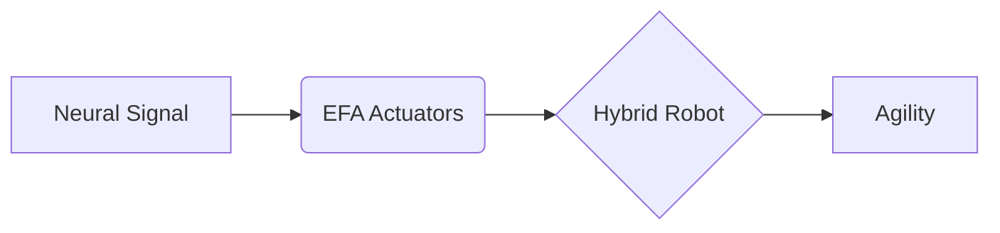
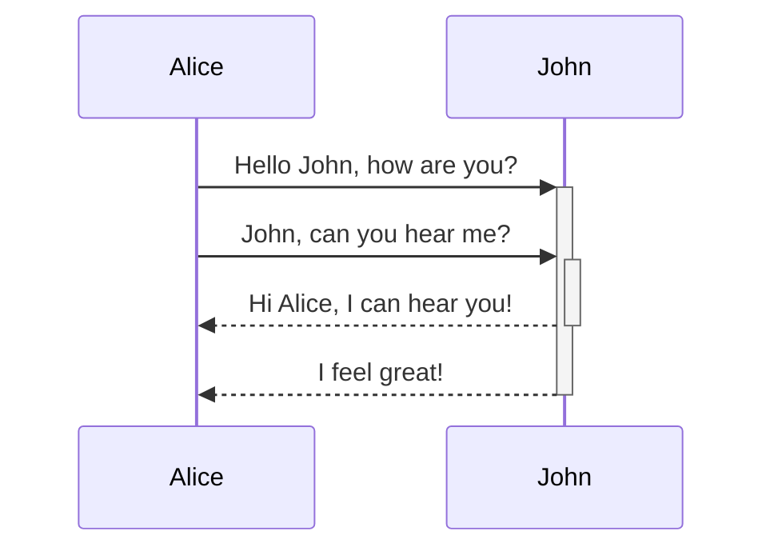
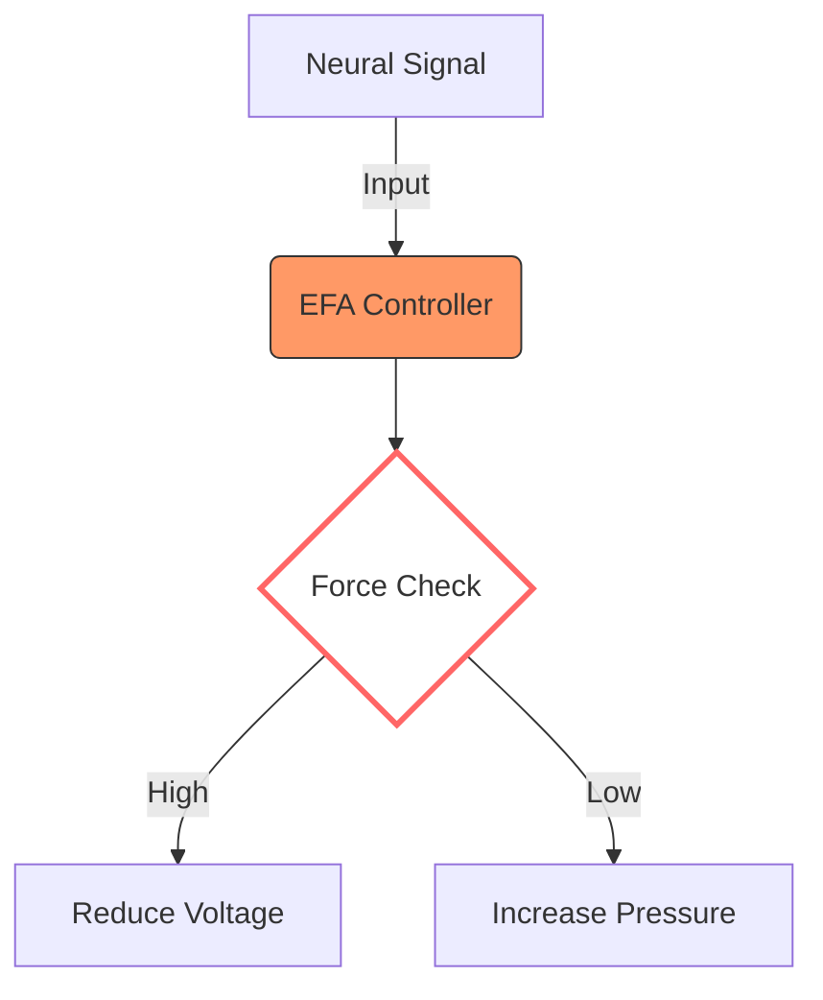
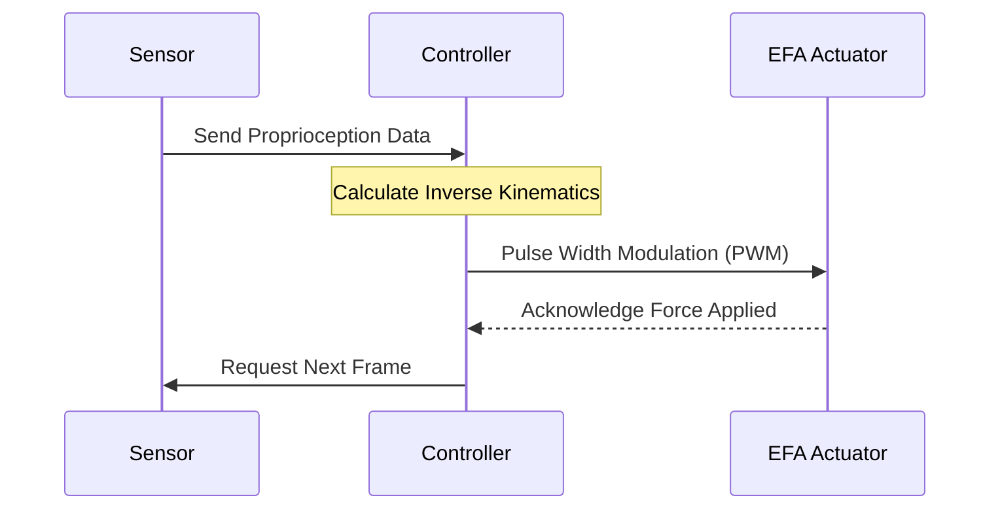
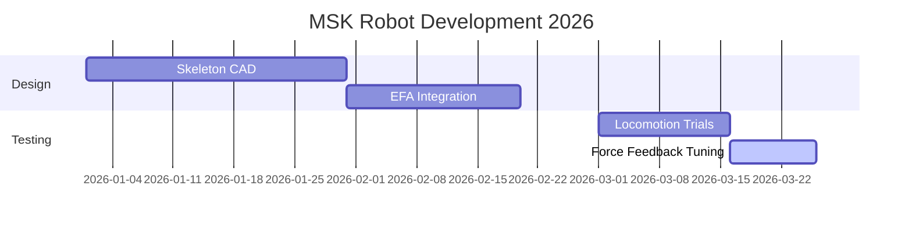
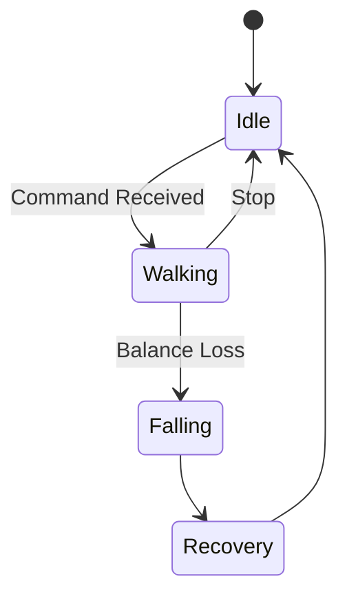
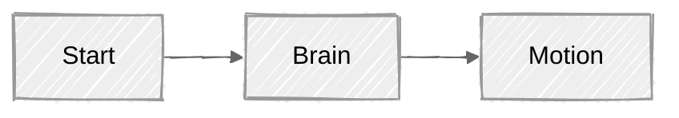
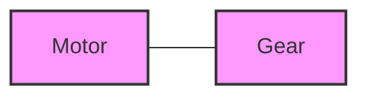
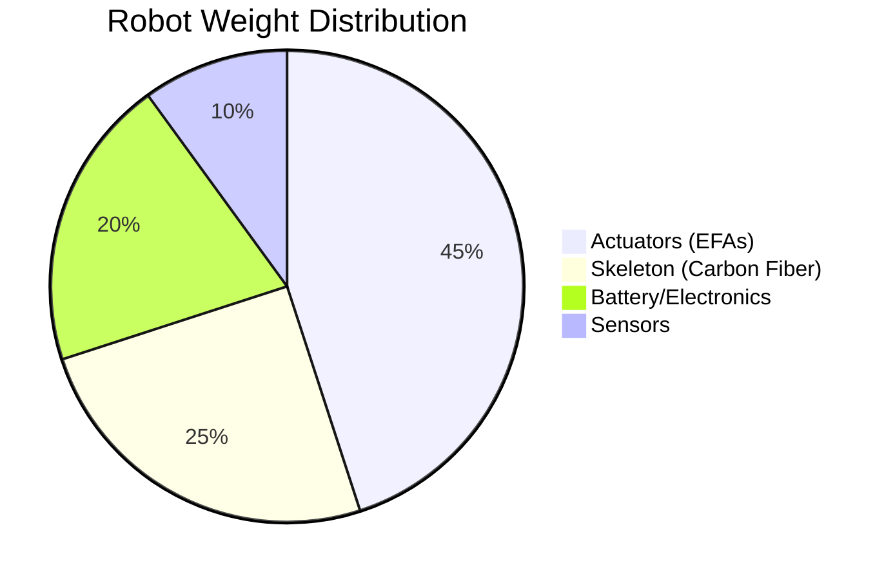
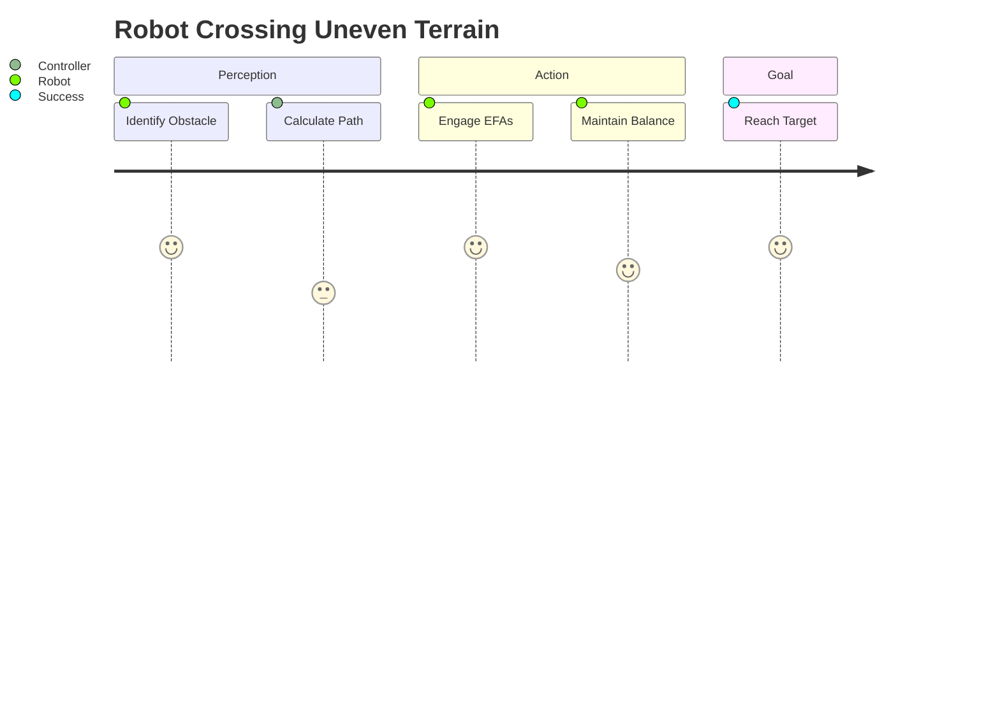

<progress value="75" max="100"></progress>PROGRESS BAR

<mark style="background: #FF5555; color: white">CRITICAL</mark>

> [!Overall Objective]+

> [!SUCCESS] Key Advantages
> * **High Agility:** Replicates MSK structures.
> * **Efficiency:** Powered by `EFAs`.
> * **Force Control:** Neuromechanically-inspired.

> [!ABSTRACT] 

>[!tip]

> [!faq]

>[!danger]

>[!missing]

> [!FAILURE] 
> FAILURE

> [!QUESTION]
> qUESTION

>[!BUG]
>BUG

>[!EXAMPLE]-
>EXAMPLE

> [!TODO]

> [!cite] "A robotic evolution that uses artificial muscles combined with an articulated skeleton."

> [!MATH] Optimization Function
> $$\min_{u} \int_{0}^{T} L(x, u) dt$$

> [!FIG] Figure 1: MSK Architecture
> ![[your-robot-image.jpg]]

> [!QUOTE]

> [!IMPORTANT] 
>- the `+` and `-` are powerful. If you have a document with 10 technical specs, put each one in a `> [!INFO]-` box. This creates an **Accordion** effect where the reader only opens the parts they want to read
>- You aren't stuck with the names above. You can use the **style** of one callout but give it a **custom title**. Ex: [!abstract] Executive Summary: The MSK Evolution
>- https://obsidian.md/help/callouts

>[!miscellaneous]-
>Create Your Own (No Plugins): If you want a callout that doesn't exist (like one specifically for **"Robot Spec"**), you can create it with a tiny bit of CSS.
>1. Go to **Settings > Appearance > CSS Snippets**.
>2. Click the folder icon and create a file called `custom-callouts.css`.
>3. Paste this in: 
>   .callout[data-callout="robot"] {    --callout-color: 0, 191, 255; /* Deep Sky Blue */--callout-icon: lucide-bot;   /* Uses a robot icon */    }
>4. - Enable the snippet in Obsidian.
>5. **Usage:** `> [!robot] New Actuator Spec`

> [!ABSTRACT] Goal: Human-level Agility
> Replicating the MSK system requires two things:
> > [!INFO] 1. Hardware
> > Electrofluidic Actuators (EFAs)
> 
> > [!INFO] 2. Software
> > Neuromechanically-inspired controllers

|                                                            |                                                                         |
| :--------------------------------------------------------- | :---------------------------------------------------------------------- |
| > [!SUCCESS] Advantages   - High DoF   - Lightweight | > [!FAILURE] Current Limits   - Power density   - Heat management |

> [!TODO] **Next Milestones**
> - [x] Define EFA parameters
> - [/] Prototype musculoskeletal leg    
> - [ ] Test force-control algorithm

  
<strong>XYZ</strong>

kcnk

# Mermaid : WOW🤯!!!!!
- **TD/TB:** Top Down
- **LR:** Left to Right

