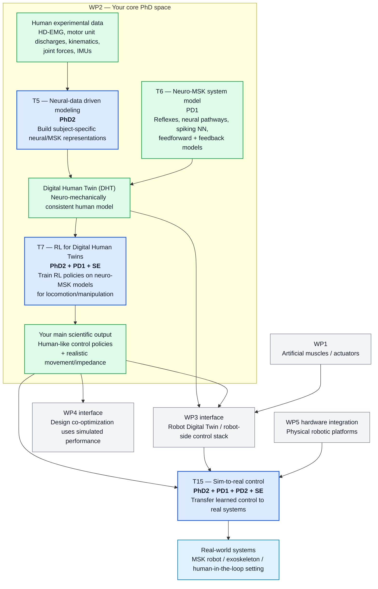
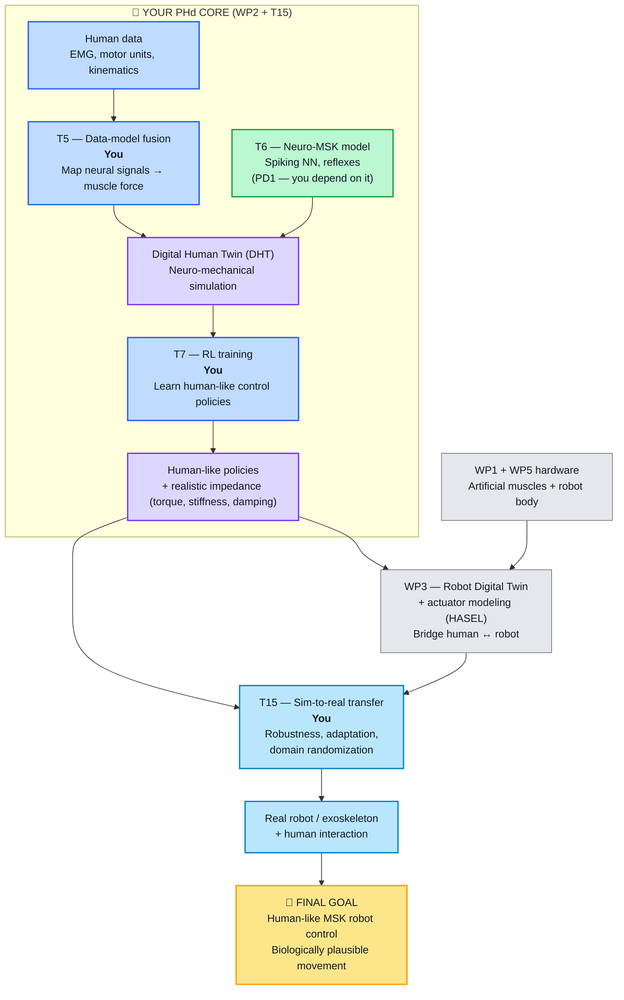
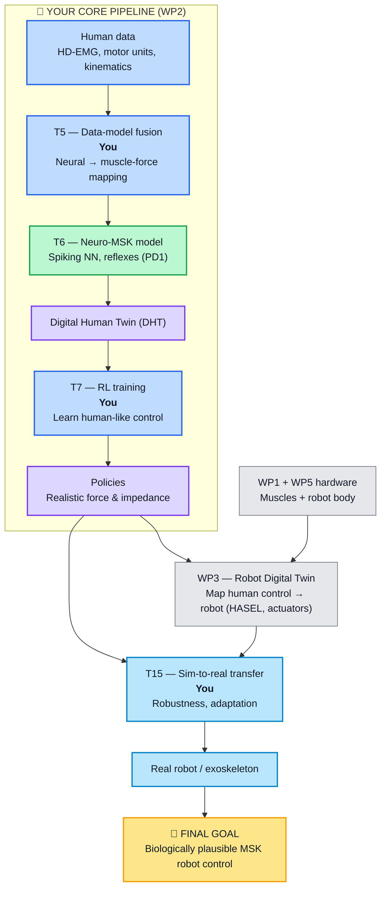
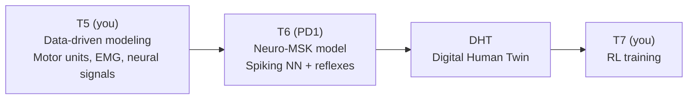

> [!Overall Objective]+
We develop and optimize a new generation of autonomous robots that replicate the architecture and actuation structure of the human musculoskeletal (MSK) system, equipped with robust, neuromechanically-inspired force controllers i.e., outperforming 
rigid robots in real-life locomotion and manipulation.
>
**a robotic evolution that uses artificial muscles combined with an articulated skeleton, as force-controlled by neural mechanisms as seen in animals and humans**
>
**==$\Rightarrow$ Here, we propose to create the first computationally optimized hybrid rigid-soft robot powered by electrofluidic actuators (EFAs) withboth a denser degree of freedom (DoF) and more agility than any other robot to date==**

Human-inspired neural control policies and rapid ML-based robot optimization will require an interdisciplinary collaboration that brings in a deep comprehension of the human neuro-MSK system and hybrid rigid-soft robotic system design.

>[!ABSTRACT]  **Learn human-like force control at the neural level $\implies$ generate policies $\implies$ transfer to robots**
>So the final final goal is to develop a robot that moves in a biologically plausible way somehow and to do so, there are 2 parts hardware (not my task) and software (control). So we need to learn how to move in a biologically plausible way $\implies$ We need a simulation on which we can train the policies and since we want it as biologically plausible as possible we need to go deeper than just the muscle level, we want to go to the level of the alpha motor unit (**neurons**). 
> > [!todo] **My tasks (or partly) I think**:
> >  $\implies$ We need a good understanding of how the human nervous system commands mechanical force. This would provide the highest temporal and spatial resolution for robust force control which is critical to develop control strategies for MSK robots. $\implies$ **Data-model fusion approach** will gives us in-vivo characterization of how limb movements are controlled in the muscle-force domain by the $\alpha$-motor neurons **(Task 5)** $\implies$ This in-vivo characterization will enablebuilding numerical models of how spinal neurons control complex, non-linear MSK systems (spiking NN for the control of MSK force) **(Task 6)**  
> >As soon as we have this simulation, it can be integrated within a new RL framework based on myosuite and MSK motor control.
> > >[!success] RL-powered simulations will reproduce not only realistic kinematic data but also the underlying MSK impedances (the movements and environment interactions will be based on realistic values for joint torque, stiffness, damping and force.) **(Task 7)**
> > > >[!failure] If DHT (Digital Human Twin) does not achieve realistic movements, simplify the amount of neuro-mechanical variables to be reproduced in-silico (simulation of realistic joint impedance properties (torque, stiffness) is prioritized)
> >
> > Of course, it should be robust to perturbations and will be state- and environment- dependent.  
> > ![[Pasted image 20260410165009.png]]
> 
> The whole purpose of this is I think to create a scalable thing, we don't want to have a model adapted to a specific robot. So we want to have a model working on a DHT that we would then transfer to anz robot provided that we have a model linking the robot to our DHT. and for the HASEL specifically, this is **WP3**.

### My task in all this : (c) a novel neuro-mechanical modeling approach that uses (d) RL and machine learning-based co-optimization for synthesizing key human neuro-muscular mechanisms of movement control into robot’s design and force-control schematics.

Tasks in which I may be involved:
- WP2: Neural data-driven MSK modeling: The central idea is to drive the in silico central nervous system (CNS) framework using in vivo neuro-muscular recordings including decoded α-motor neuron discharges [114, 139], and estimation of skeletaljoint forces using inverse dynamics facilitated by data recorded with wearable force sensors and inertial measurement units 
  > [!INFO] I am not sure I would be involved in this but it would definitely be involved in this to understand what lies behind the model 

## Task 5
This is the **data → model step**

- Input:
	- HD-EMG
	- motor neuron discharges
	- kinematics
- Output:
	- motor unit properties
	- neural activation patterns

💡 This is:  
👉 **data-model fusion**

## Task 6
This is the **structured neuro-control model**

- spiking neural network
- sensory + motor neurons
- feedback loops
- reflexes

BUT — and this is important:

👉 It is **built using outputs from T5**

## 🧩 T5 gives:

👉 **what the system does (data)**

## 🧩 T6 builds:

👉 **a system that can reproduce that behavior**

