> [!Overall Objective]+
We develop and optimize a new generation of autonomous robots that replicate the architecture and actuation structure of the human musculoskeletal (MSK) system, equipped with robust, neuromechanically-inspired force controllers i.e., outperforming 
rigid robots in real-life locomotion and manipulation.
>
**a robotic evolution that uses artificial muscles combined with an articulated skeleton, as force-controlled by neural mechanisms as seen in animals and humans**
>
**==$\Rightarrow$ Here, we propose to create the first computationally optimized hybrid rigid-soft robot powered by electrofluidic actuators (EFAs) withboth a denser degree of freedom (DoF) and more agility than any other robot to date==**

Human-inspired neural control policies and rapid machinelearning-based robot optimization will require an interdisciplinary collaboration that brings in a deep comprehension of the human neuro-MSK system and hybrid rigid-soft robotic system design.

### My task in all this : (c) a novel neuro-mechanical modeling approach that uses (d) RL and machine learning-based co-optimization for synthesizing key human neuro-muscular mechanisms of movement control into robot’s design and force-control schematics.

Tasks in which I may be involved:
- WP2: Neural data-driven MSK modeling: The central idea is to drive the in silico central nervous system (CNS) framework using in vivo neuro-muscular recordings including decoded α-motor neuron discharges [114, 139], and estimation of skeletaljoint forces using inverse dynamics facilitated by data recorded with wearable force sensors and inertial measurement units 
  > [!INFO] I am not sure I would be involved in this but it would definitely be involved in this to understand what lies behind the model 

```mermaid
flowchart LR
  %% =========================
  %% STYLES
  %% =========================
  classDef you fill:#dbeafe,stroke:#2563eb,stroke-width:2px,color:#111827;
  classDef wp fill:#f3f4f6,stroke:#374151,stroke-width:1.5px,color:#111827;
  classDef task fill:#ffffff,stroke:#6b7280,stroke-width:1px,color:#111827;
  classDef hardware fill:#fef3c7,stroke:#d97706,stroke-width:1px,color:#111827;
  classDef human fill:#dcfce7,stroke:#16a34a,stroke-width:1px,color:#111827;
  classDef control fill:#ede9fe,stroke:#7c3aed,stroke-width:1px,color:#111827;
  classDef optimize fill:#fee2e2,stroke:#dc2626,stroke-width:1px,color:#111827;
  classDef integrate fill:#e0f2fe,stroke:#0284c7,stroke-width:1px,color:#111827;

  %% =========================
  %% WP1
  %% =========================
  subgraph WP1["WP1 — Artificial muscles"]
    direction TB
    T1["T1 Optimize actuators<br/>PhD1 + ER"]
    T2["T2 Actuator packs arrangement<br/>PhD1 + ER"]
    T3["T3 Bio-inspired artificial muscle<br/>PhD1 + ER"]
    T4["T4 Muscle benchmark<br/>PhD1"]
  end
  class WP1 wp
  class T1,T2,T3,T4 hardware

  %% =========================
  %% WP2
  %% =========================
  subgraph WP2["WP2 — Digital human twin"]
    direction TB
    T5["T5 Neural-data driven modeling<br/>PhD2"]
    T6["T6 Neuro-MSK system model<br/>PD1"]
    T7["T7 RL for digital human twins<br/>PhD2 + PD1 + SE"]
  end
  class WP2 wp
  class T5,T6,T7 human
  class T5,T7 you

  %% =========================
  %% WP3
  %% =========================
  subgraph WP3["WP3 — Model and control"]
    direction TB
    T8["T8 MP actuator modeling<br/>PD2"]
    T9["T9 Include force and self-sensing<br/>PhD3"]
    T10["T10 Digital MSK robot twin<br/>PhD3 + SE"]
    T11["T11 Actuation skill acquisition<br/>PhD3"]
  end
  class WP3 wp
  class T8,T9,T10,T11 control

  %% =========================
  %% WP4
  %% =========================
  subgraph WP4["WP4 — Co-optimization"]
    direction TB
    T12["T12 Design space parametrization<br/>PhD5 + ER"]
    T13["T13 Bio-inspired objective definition<br/>PhD5"]
    T14["T14 Computational co-optimization<br/>PhD5"]
  end
  class WP4 wp
  class T12,T13,T14 optimize

  %% =========================
  %% WP5
  %% =========================
  subgraph WP5["WP5 — Integration and tests"]
    direction TB
    T15["T15 Sim-to-real control<br/>PhD2 + PD1 + PD2 + SE"]
    T16["T16 Bipedal robot prototype<br/>PhD4 + ER"]
    T17["T17 Bipedal benchmark<br/>PhD4"]
    T18["T18 Robotic hand prototype<br/>PhD4 + ER"]
    T19["T19 Hand benchmark<br/>PhD4"]
  end
  class WP5 wp
  class T15,T16,T17,T18,T19 integrate
  class T15 you

  %% =========================
  %% INTERNAL FLOWS
  %% =========================
  T1 --> T2 --> T3 --> T4
  T5 --> T7
  T6 --> T7
  T8 --> T9 --> T10 --> T11
  T12 --> T14
  T13 --> T14
  T16 --> T17
  T18 --> T19

  %% =========================
  %% CROSS-WP DEPENDENCIES
  %% =========================
  T3 --> T10
  T4 --> T10

  T5 --> T10
  T6 --> T10
  T7 --> T11

  T8 --> T10
  T9 --> T10
  T10 --> T11

  T10 --> T14
  T11 --> T14

  T14 --> T16
  T14 --> T18

  T11 --> T15
  T10 --> T15
  T16 --> T15
  T18 --> T15

  T15 --> T17
  T15 --> T19

  %% =========================
  %% HIGH-LEVEL CONCEPT NODES
  %% =========================
  H1["Human neural & biomechanical data"]
  H2["Digital Human Twin (DHT)"]
  H3["Robot Digital Twin (DRT)"]
  H4["RL / IL / control policies"]
  H5["Optimized physical robots"]
  H6["Real-world transfer & testing"]

  class H1,H2,H3,H4,H5,H6 task

  H1 --> T5
  T5 --> H2
  T6 --> H2
  T7 --> H4

  H2 --> T10
  T3 --> H3
  T8 --> H3
  T9 --> H3
  T10 --> H3

  H3 --> T11
  T11 --> H4
  H3 --> T14
  H4 --> T14

  T14 --> H5
  H5 --> T16
  H5 --> T18

  T15 --> H6
  H6 --> T17
  H6 --> T19
```

